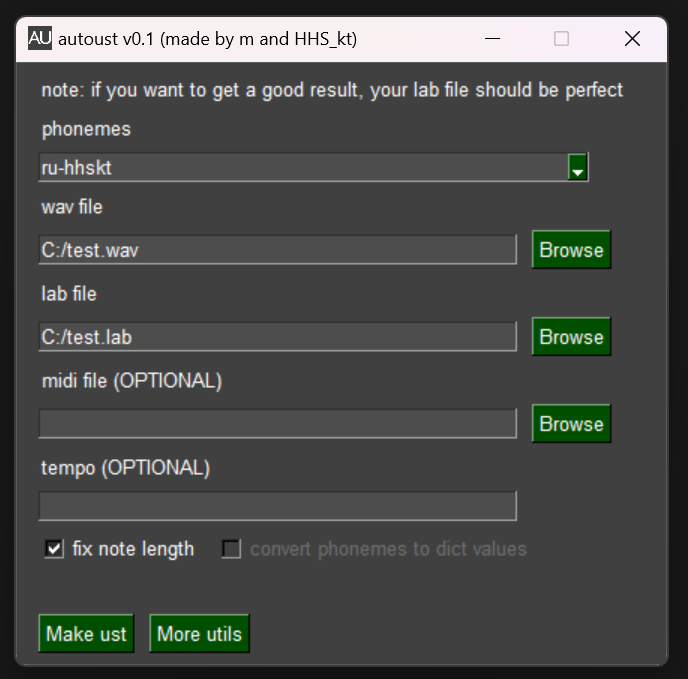

# Autoust

Make ust from wav and lab files

## Usage
Run "run.bat", fill "wav file" and "lab file" fields, press "Make ust"

## Manual install
Put python 3.8 in the app directory, run "setup_CPU.bat" or "setup_GPU.bat"